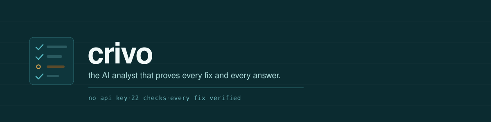

<div align="center">



<br>

**Diagnose and clean a messy dataset in one line. No API key, and every fix is re-checked before it counts.**


&nbsp;


[What it does](#what-it-does) · [How it works](#how-it-works) · [The agent](#the-agent) · [MCP server](#mcp-server)

</div>

Most tools will chat with your dataframe. None of them check whether the cleaning
was right. crivo does. It reads a messy table, tells you what is broken,
fixes the parts that are safe to fix, and re-runs the check on every fix before it
keeps it. The half that does this needs no API key and no setup.

## Start here

Not on PyPI yet, so install it from the repo:

```bash
pip install git+https://github.com/aarmens702-hub/analyst-agent
```

Then point it at a file or a DataFrame you already have:

```python
import crivo

report = crivo.diagnose("transactions.csv")   # runs 22 checks, no key, no kernel
report                                     # prints the list, or a card in a notebook

clean, summary = crivo.clean(report)          # applies the safe fixes, re-checks each one
summary.needs_review                       # the ambiguous ones it will not guess on
crivo.write(clean, "clean.parquet")           # your data back out, any format
```

`crivo.read` handles the formats you actually get data in: csv, tsv, parquet, xlsx,
json, jsonl, feather, orc, compressed files (`.gz`, `.zip`, `.bz2`), parquet
folders, a database connection, or a JSON API.

## What it does

- Runs 22 checks on any table and grades each finding: safe to fix, fix with a
  check, or needs a person.
- Fixes the safe ones and re-checks every fix. If the check still fires, it
  throws the fix out and reports it instead of keeping a bad one.
- Reads from files, compressed files, folders, databases, and JSON APIs, all
  through one `crivo.read`.
- Shows up as a card in a notebook, and a data-quality chart with `.plot()`.
- Ships every agent answer with the code it ran, the checks that passed, and
  where the numbers came from.
- Saves a fix that worked as a reusable skill, but only after it passes its own
  test and you say yes.
- Runs as an MCP server, so Claude Desktop, Cursor, or Claude Code can call it.
- Has a headless mode for CI, where only the safe fixes run and the rest are
  reported.

## How it works

**Two halves.** The keyless half (`diagnose`, `clean`, `read`) is plain Python.
No key, no kernel, nothing to trust yet. The agent half writes and runs code for
the harder fixes, but the model never sees your raw rows, only the schema and a
few samples, and every step waits for your OK.

**One rule for both.** A fix counts only when the check that found the problem
stops firing, and the rows and untouched columns still line up. If it does not
clear, the fix is reverted and sent back to you. Nothing is trusted because a
rule ran. It is trusted because the signal went quiet.

**A trail on every answer.** An answer is trusted only if you can trace it back
to the raw bytes through checks that passed at each step. `/why` prints that path,
and says how it broke when it breaks.

Every finding gets one of three grades:

| grade | means | what happens |
| --- | --- | --- |
| safe | mechanical, no judgement | fixed and re-checked |
| check | one plausible fix, worth confirming | fixed, then flagged |
| person | a real judgement call | reported, never decided for you |

## The agent

The keyless half tells you what is wrong. The agent is the part that fixes the
hard cases, and it earns that with a stricter contract. Set a model key and run
it:

```bash
echo 'DEEPSEEK_API_KEY=sk-...' > .env       # or ANTHROPIC_API_KEY
python -m crivo
```

```
/load data/messy.csv sales      load a file as a variable
which region grew the most?     ask in plain english; the code is gated, then runs
/clean sales                    diagnose, then fix one at a time
/why                            where an answer came from, and whether it holds
/skills                         the fixes it has learned and kept
```

Every line of model-written code stops at a gate. You run it, send a note back,
or skip it. The kernel is a subprocess by default, or a `--network=none`
container in sandbox mode.

## MCP server

Any MCP client can drive crivo as tools. The gates follow the same rule
as headless mode: the safe fixes run, the judgement calls come back for a person,
and the calling agent never decides them.

| tool | what it does |
| --- | --- |
| `diagnose_file` | the 22-check report on a file. free, keyless, read-only |
| `clean_file` | headless clean; judgement calls are reported, not decided |
| `open_data` | load a file into a session and get a profile |
| `ask` | answer a question over a session, with checks and lineage |
| `why` | the trail behind a session's answers |
| `close_session` | shut the session down |

## In one sentence

It is the one-line report of ydata-profiling and the plain-english querying of
pandas-ai, but with no API key and a receipt for every fix.

<details>
<summary><b>The 22 checks</b></summary>

<br>

Numbers stored as text, mixed date formats, fake missing values (`N/A`, `-`, `null`
typed into a cell), whitespace and encoding damage, spelling and case variants of
the same category, duplicate rows, near-duplicate rows, constant columns, columns
that are almost entirely empty, values that contradict each other, outliers,
schema drift across a set of files, and more. Each one is a named detector that
either fires with evidence or reports the column clean. Absence is a checked
claim, not a silence.

</details>

<details>
<summary><b>How the agent runs code safely</b></summary>

<br>

The model runs on the host. It drives an IPython kernel that lives inside a
container (a subprocess in dev, `--network=none` in sandbox mode) over a small
stdio protocol. Your datasets are variables in that kernel. The model sees the
schema, some statistics, and truncated samples, never the raw rows. It writes
short pandas cells; each one stops at a gate; a traceback comes back as the next
thing it reads and works from. A cleaned dataset is always a copy with its lineage
recorded. Recursion is capped at one level.

</details>

<details>
<summary><b>How a fix becomes a reusable skill</b></summary>

<br>

After a clean run, each fix the model wrote is rewritten as a general
`fix(df, columns)` and has to earn its place. It has to trip the detector on the
original frozen case, clear it, and leave the never-broken rows alone. Its own
shipped test has to pass. Then a person says yes. New skills start on probation
(retrieved and applied, but always gated). Three wins across two different
datasets promote a skill; two failures in a row retire it. No model decides
admission; the sandbox and a person do.

</details>

## Where it's at

409 tests pass. The keyless half does no network, subprocess, or Docker work when
you import it, so it is safe to use in any notebook cell. The agent half needs a
model key and a kernel. MIT licensed. Not on PyPI yet; publishing is the next
step.

## Development

```bash
uv run pytest                    # the full suite
uv run pytest -m docker          # the container tests, opt in
uv run ruff check --fix . && uv run ruff format .
```

Specs live in `specs/`. The design notes for each phase are there, newest last.
