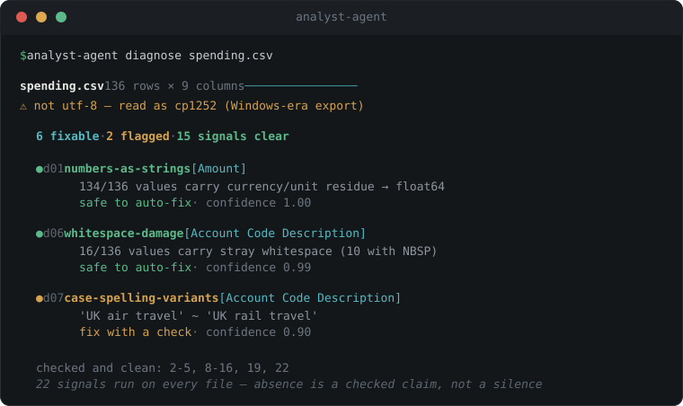

<div align="center">


<br>


**An AI analyst that cleans messy data and answers questions over it — where every result traces back to the raw file through checks that actually ran.**

[30 seconds](#30-seconds) · [First 60 seconds](docs/first-60-seconds.md) · [The agent](#the-agent) · [MCP server](#mcp-server) · [How it works](#how-it-works) · [Skills](#skills)

</div>

## 30 seconds

Point it at a file. No API key, no kernel, no Docker — nothing to trust yet:

```bash
# from source today; `pip install analyst-agent` once published (see Publishing status)
uv add git+https://github.com/aarmens702-hub/analyst-agent
```

```python
import analyst_agent as aa

report = aa.diagnose("spending.xlsx")  # or a DataFrame you already have
print(report)
```

<div align="center">

</div>

That is real output on a real UK government spending file. 22 named checks —
money stored as text, mixed date formats, fake missing values, encoding damage,
schema drift — and it tells you what it checked and found *clean*, not just what
it found. The `diagnose` half is pure Python: no model, no kernel, no key.

Then clean it — deterministically, verified, still no model:

```python
df = aa.read("data.csv")  # one reader: csv, tsv, parquet, xlsx, json, jsonl
cleaned, summary = aa.clean(df)  # safe fixes applied and re-checked; the rest deferred
aa.write(cleaned, "out.xlsx")  # one writer, format from the extension
```

In a notebook, skip `print` — `report` and `summary` render themselves as
styled cards, colour-coded by severity. The same import registers a `.aa`
accessor on every DataFrame, so it reads like `df.describe()`:

```python
df.aa.diagnose()  # the report, as a card
cleaned, summary = df.aa.clean()  # the summary, as a card — before/after per fix
```

Still no model, no kernel, no Docker — the accessor and the cards are part of
the same keyless half.

Prefer the terminal? `analyst-agent diagnose spending.xlsx` prints the same
report in colour. New to the library? [First 60 seconds](docs/first-60-seconds.md)
walks from install to a cleaned file.

## The agent

The rest of the project is the part that *changes* your data, and it earns that
with a stricter contract. Set a model key and run the agent:

```bash
uv sync
echo 'DEEPSEEK_API_KEY=sk-...' > .env       # or ANALYST_PROVIDER=claude + ANTHROPIC_API_KEY
uv run python -m analyst_agent
```

In the REPL:

```
/load data/raha/beers/dirty.csv beers        load a CSV as a kernel variable
which brewery has the most beers?            ask anything — code is gated, then runs
/clean beers                                 diagnose 22 diseases, fix one by one
/clean-family "data/vancouver/*.csv" tax     harmonize a family, then clean each slice
/skills                                      the library: what it holds, what it earned
/why                                         where an answer came from, and if it holds
/quit
```

Every model-written cell stops at a gate: `[r]un` executes it, `[j]eject`
sends a steering note back, `[s]kip` (clean mode) leaves a finding unfixed.
`--auto-run` skips gates for development. `--docker` runs the kernel inside a
no-network container instead of a subprocess.

For orchestration — other agents, scripts, CI — there is a headless one-shot
mode with an approval policy safe for unattended use (only AUTO-grade fixes
run; anything needing judgement is reported, not decided):

```bash
uv run python -m analyst_agent clean data/messy.csv --json
```

## MCP server

Any MCP client (Claude Desktop, Claude Code, Cursor) can drive analyst-agent
as native tools. Local config:

```json
{
  "mcpServers": {
    "analyst-agent": {
      "command": "uv",
      "args": ["--directory", "/absolute/path/to/analyst-agent", "run", "analyst-agent-mcp"],
      "env": { "DEEPSEEK_API_KEY": "sk-..." }
    }
  }
}
```

Claude Code takes the same block in `.mcp.json`; set `ANALYST_PROVIDER=claude`
plus `ANTHROPIC_API_KEY` to swap the model.

| tool | purpose |
| --- | --- |
| `diagnose_file` | the 22-check report on a file: free, keyless, read-only |
| `clean_file` | headless clean: judgement calls deferred and reported, never decided |
| `open_data` | load a file into a persistent kernel, get a session id and profile |
| `ask` | answer a question over an open session, with executed checks and lineage |
| `why` | the provenance chain for an open session |
| `close_session` | shut the session's kernel |

Gates in MCP mode follow the same policy as headless mode: AUTO-grade fixes
run, judgement calls come back in `needs_human`, and the calling agent never
decides them.

## How it compares

We don't out-broad the broad tools. We're the only one that verifies the
cleaning and keeps an audit trail — the only one you'd trust with a number that
matters.

| | Ask &amp; chart | Cleans your data | Verifies fixes | Audit trail | Scale |
| --- | :---: | :---: | :---: | :---: | :---: |
| pandas-ai | ✓ | ad hoc | — | — | in-memory |
| Code Interpreter / Julius | ✓ | ad hoc | — | — | in-memory |
| Great Expectations / dbt | — | — | you write rules | ✓ | warehouse |
| ydata-profiling | — | — | — | report only | in-memory |
| **analyst-agent** | *planned* | **verified** | **✓** | **✓** | in-memory |

## How it works

The LLM never sees your data. It sees a schema/stats profile and a live
variable registry, and writes small code cells against data that stays loaded
in a persistent kernel (subprocess in dev, `--network none` Docker in sandbox
mode), reached over an NDJSON stdio protocol. Tracebacks come back as
observations, so repair is just the next iteration.

Three things have to hold before a claim counts:

- **A check mark comes only from an assert that executed.** Nothing is marked
  verified on the model's say-so.
- **A cleaning fix counts as verified** only when the detection signal that
  found the disease re-runs clean, row and untouched-column invariants hold,
  and the model's own asserts pass. Otherwise it reverts.
- **An answer is trusted** only if it is reachable from raw bytes with passing
  checks on every step between. `/why` prints that chain, and says which of the
  two ways it failed when it fails.

An intent check runs before each answer ships: one narrow call that reads the
executed code back, states what it actually computed, and diffs that against
the question. It catches correct code answering the wrong question — the
failure assertions structurally cannot see.

## Skills

A verified fix does not die with the session. After a clean run, each
model-authored fix is rewritten as a column-general `fix(df, columns)` and has
to earn its place:

1. Re-run against the **frozen original case**: it must still trip the detector
   there, must clear it, and must leave never-broken rows alone.
2. Its own shipped test must pass.
3. A human says yes.

Both executions happen inside the sandbox. No LLM judges admission.

Admitted skills start on **probation** — retrieved and applied, but always
gated. Three successes across **two different datasets** promote a skill to
**proven**, and a proven skill on an AUTO-grade finding fixes it with no model
call and no gate. Verification still runs. Two consecutive verification
failures retire it to `skills/retired/`, and the active library is capped.

Skills are [Agent Skills](https://agentskills.io) `SKILL.md` folders, so the
library is portable to any tool that speaks the standard:

```bash
uv run python scripts/export_skills.py --out dist/skills
```

## Development

```bash
uv run pytest                    # full suite (kernel protocol runs containerless)
uv run pytest -m docker          # container end-to-end (needs Docker running)
uv run ruff check --fix . && uv run ruff format .
uv run python scripts/score_fixes.py <cleaned.parquet> beers   # fix P/R vs truth
uv run python scripts/ablate_governance.py                     # governed vs not
```

Tests are guarded by [tdd-guard](https://github.com/nizos/tdd-guard): one new
test at a time, red before green.

Specs live in `specs/` — P0 core, P1 clean mode, P2 skill harness, P2.5 family
mode. Research and positioning:
`../mailo/coop-project/analyst-agent-brief.md` and
`analyst-agent-build-research.md`.

## Publishing status

Publish-ready, not published. `uv build` produces a verified sdist and wheel
carrying both console entry points; `docs/PUBLISHING.md` is the 30-minute
runbook. The single blocker is a human decision: choosing the license (MIT
recommended). Everything after that is mechanical.
